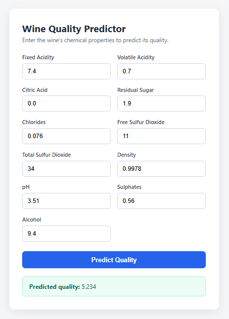

# End to End Data Science Project

### Workflows--ML Pipeline

1. Data Ingestion
2. Data Validation
3. Data Transformation --Feature Engineering, Data Preprocessing
4. Model Trainer
5. Model Evaluation - MLFLOW, Dagshub

## Workflows 
1. Update config.yamll 
2. Update schema.yaml 
3. Update params.yaml 
4. Update the entity 
5. Update the configuration manager in src config 
6. Update the components 
7. Update the pipeline 
8. Update the main.py 

## How to run

```bash
python main.py        # train the pipeline
python app.py         # start Flask on http://localhost:8080
```

<p align="center">
  
  <br>
  <em>Home page of the Wine Quality Predictor</em>
</p>
